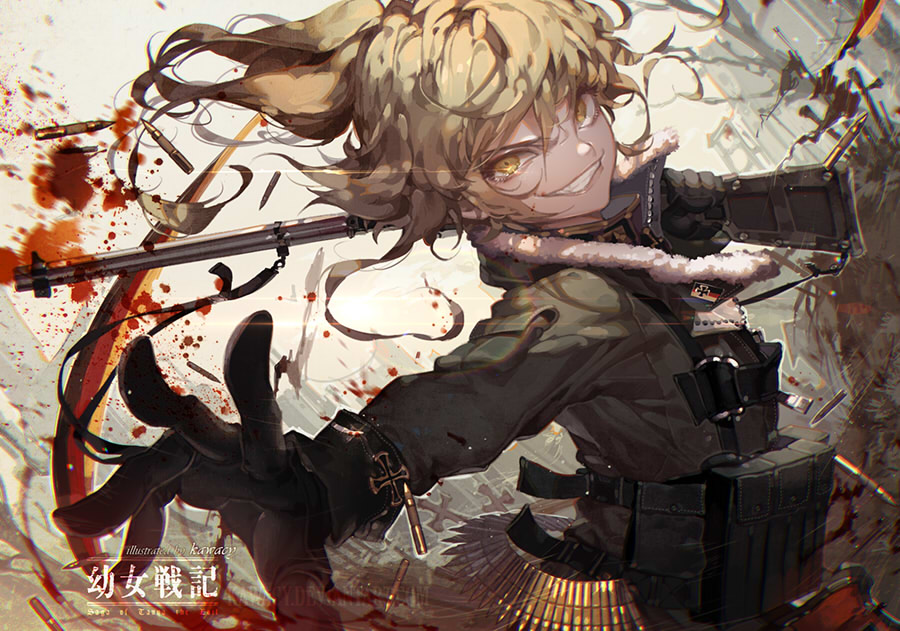

# Tanya von Degurechaff

## The main protagonist of the light novel/anime [Youjo Senki: Saga of Tanya the Evil](https://en.wikipedia.org/wiki/Saga_of_Tanya_the_Evil). Originally a salaryman who was murdered in 2013, he was reborn as a girl living in an alternate version of Europe during the late Interwar period.
## At just nine years of age, Tanya enters the [Empire](https://youjo-senki.fandom.com/wiki/Empire)'s Mages troops and is promoted to Second Lieutenant. Her talents, strategies, efficiency, and ruthlessness make her a useful asset for the Empire and a threat on the battlefield.
## Since she graduated from the War College as one of the twelve knights, she's been granted the title of von.
## Moreover, she leads her own newly-formed Mage Battalion known as the Imperial Army 203rd Air Mage Battalion. 

###### I didn't want to create myself a new cv. See my original cv [here](https://xivez.github.io/RESUME-FORM/).